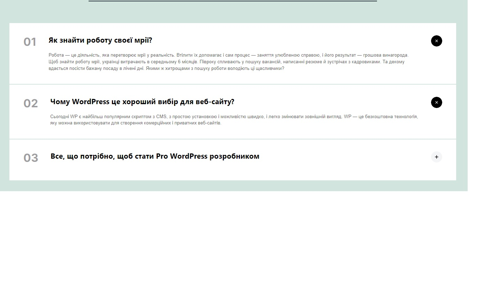

# GUTENACCORDION

## Description

This is a custom Gutenberg block.
- It has the ability to add an unlimited number of child Accordion element blocks.
- Each child block has the ability to add a header and content.
- The content has all standard options for text formatting from the standard "paragraph" block (bold, italic, links, etc.)
- The block adapts to different screen sizes, starting with a screen width of 320 pixels.

## Technologies
- Wordpress
- PHP
- HTML
- SCSS
- JavaScript

## Example:
# gutenbergAccordion
